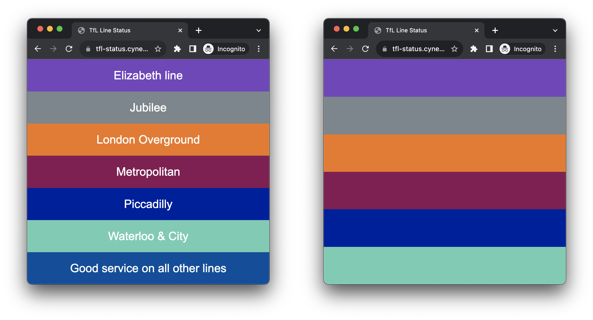

# Super Simple TfL Status 🚇

[](https://github.com/mnbf9rca/super_simple_tfl_status/actions/workflows/tests.yml)
[](https://github.com/mnbf9rca/super_simple_tfl_status/actions/workflows/github-code-scanning/codeql)
[](https://codecov.io/gh/mnbf9rca/super_simple_tfl_status)
[](https://sourcery.ai)
[](https://opensource.org/licenses/MIT)
[](https://nodejs.org/)

## Overview

Get real-time TfL (Transport for London) service status in a straightforward and minimalist design. No more fumbling through apps or web pages to know if your line is running smoothly. Built with pure JavaScript (ok, a tiny bit of CSS to allow the new [Overground line colours](https://madeby.tfl.gov.uk/2024/02/15/overground_line_names/) to be striped), and calling the [TfL API](https://api-portal.tfl.gov.uk/api-details#api=Line&operation=Line_StatusByModeByPathModesQueryDetailQuerySeverityLevel) directly, this lightweight tool can be easily integrated into your workflow or dashboard.



## Live Demos 🚀

Experience Super Simple TfL Status in action with these quick demo links, or embed these pages in your home automation dashboard.

| Description               | Live Link                                                                                              |
| ------------------------- | ------------------------------------------------------------------------------------------------------ |
| **Tube Only**             | [🚇 Tube](https://tfl-status.cynexia.com/?mode=tube)                                                   |
| **Elizabeth Line Only**   | [🚆 Elizabeth Line](https://tfl-status.cynexia.com/?mode=elizabeth-line)                               |
| **Tube + Elizabeth Line** | [🚇🚆 Combo 1](https://tfl-status.cynexia.com/?mode=tube,elizabeth-line)                               |
| **Tube + Overground**     | [🚇🚞 Combo 2](https://tfl-status.cynexia.com/?mode=tube,overground)                                   |
| **All Modes**             | [🌐 All Modes](https://tfl-status.cynexia.com/?mode=tube,elizabeth-line,overground)                    |
| **All Modes + Names**     | [🌐 All Modes + Names](https://tfl-status.cynexia.com/?mode=tube,elizabeth-line,overground&names=true) |

Click on the live links to explore different configurations and find the one that suits you the best!

## Features

- 🚀 **Fast**: Fetches and displays statuses in seconds
- 🎨 **Colour-Coded**: Uses official TfL line colours for quick identification
- 🔍 **Configurable**: Choose which modes of transport to display
- 🛠 **Simple Codebase**: Easy to extend or modify

## Quick Start

### Pre-requisites

- A modern web browser
- Internet connection

### Usage

You can use the hosted version at https://tfl-status.cynexia.com or run your own:

1. Clone the repository: `git clone https://github.com/mnbf9rca/super_simple_tfl_status.git`
2. Open `index.html` in your web browser.

#### URL Parameters

- `mode`: Choose the mode of transportation. Default is "tube,elizabeth-line". Example: `?mode=tube,dlr`. Options are any accepted by the TfL API, although some, like `bus` are obviously less useful. You can see all available options by [using the TfL API Portal](https://api-portal.tfl.gov.uk/api-details#api=Line&operation=Line_MetaModes) to query for 'all valid modes'.
- `names`: Display the names of the lines. Default is false. Example: `?names=true`. See below for more info.

Combine parameters like this: `?mode=tube&names=true`

## Display Options 🎨

Understand how the `names` parameter changes the display when there are disruptions or no disruptions:

| Scenario                | `names=true`                                                                           | `names=false`                                  |
| ----------------------- | -------------------------------------------------------------------------------------- | ---------------------------------------------- |
| **No Disruptions**      | Shows "Good service on all lines".                                                     | Shows "Good service on all lines".             |
| **Some Disruptions**    | Shows disrupted lines with their names, followed by "Good service on all other lines." | Shows only the colours of disrupted lines.     |
| **All Lines Disrupted** | Shows all lines with disruptions and their names.                                      | Shows only the colours of all disrupted lines. |

## Development 🛠️

### Setup

This project requires **Node.js 24.x** (future LTS).

```bash
# Clone the repository
git clone https://github.com/mnbf9rca/super_simple_tfl_status.git
cd super_simple_tfl_status

# Install dependencies
npm install

# Run tests
npm test

# Run tests with coverage
npm test -- --coverage

# Check code style
npm run lint
npm run format:check
```

### Architecture

The application is built with vanilla JavaScript for maximum compatibility and minimal dependencies:

- **`site/tflStatus.js`** - Core application logic with exported functions for testing
- **`site/tflStatus.test.js`** - Comprehensive test suite (51 tests, >94% coverage)
- **`site/index.html`** - Minimal HTML page that loads the script
- **`site/style.css`** - CSS for status block styling and line colours

### Testing

Tests use Jest with jsdom environment:

- **Coverage target**: >90% for all metrics
- **Environment detection**: Handles both Node.js and browser environments
- **API mocking**: Mocks fetch and setTimeout for reliable testing
- **Hostname detection**: Tests localhost, 127.0.0.1, and 0.0.0.0 detection

### API Integration

The app calls the [TfL Unified API](https://api-portal.tfl.gov.uk/) directly:

- **Endpoint**: `https://api.tfl.gov.uk/Line/Mode/{modes}/Status`
- **Caching**: Respects Cache-Control headers for intelligent refreshing
- **Error handling**: Graceful degradation when API is unavailable

## Contributing 🤝

We welcome contributions! Please see our [Contributing Guide](CONTRIBUTING.md) for detailed information about:

- Development setup and prerequisites
- Code style guidelines (ESLint + Prettier)
- Testing requirements and patterns
- Pull request process
- Troubleshooting common issues

### Quick contribution checklist:

- [ ] Tests pass: `npm test`
- [ ] Code style: `npm run lint` and `npm run format:check`
- [ ] Coverage maintained: >90%
- [ ] JSDoc comments for new functions
- [ ] Update documentation if needed

## Troubleshooting 🔧

### Common Issues

#### Page Shows No Status or Errors

1. **Check browser console** for JavaScript errors
2. **Verify internet connection** - the app calls TfL API directly
3. **Check TfL API status** at [api-portal.tfl.gov.uk](https://api-portal.tfl.gov.uk/)
4. **Try different modes** - some transport modes may be temporarily unavailable

#### Status Not Updating

The app automatically refreshes based on TfL API Cache-Control headers (typically 5 minutes):

- **Manual refresh**: Reload the page
- **Check cache**: Look for "cache_ttl" in browser console logs
- **Development mode**: Console logs appear when hostname is localhost/127.0.0.1/0.0.0.0

#### URL Parameters Not Working

Ensure proper URL format:

- ✅ Correct: `?mode=tube&names=true`
- ❌ Incorrect: `?mode = tube & names = true`

Valid modes include: `tube`, `elizabeth-line`, `dlr`, `overground`, `tram`, `river-bus`

#### Embedding in Dashboards

For embedding in home automation dashboards:

1. Use the hosted version: `https://tfl-status.cynexia.com/`
2. Add your preferred parameters: `?mode=tube,elizabeth-line&names=true`
3. Frame or embed the URL in your dashboard
4. Status updates automatically without iframe refresh

### Performance

- **Bundle size**: ~8KB (unminified JavaScript)
- **Load time**: Typically <2 seconds including API call
- **Memory usage**: Minimal - no heavy frameworks
- **Browser support**: Modern browsers (ES6+ required)

## License

This project is licensed under the MIT License. TfL API subject to TfL's terms.
